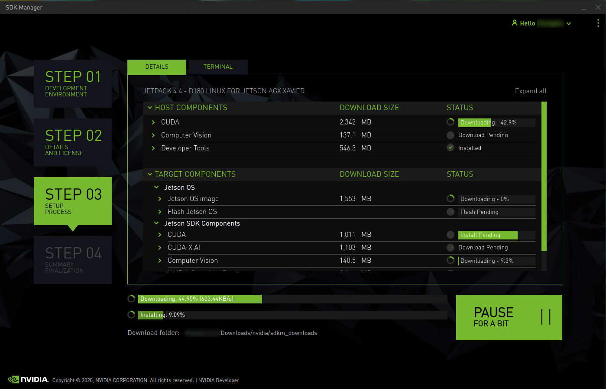

# Overview

Multirotor is a class of rotor craft that our group uses for control, perception and swarm algorithm development and testing.

## How to build a UAV platform
### 1. Solder the ESC to the PCB base plate


:::warning
Be careful with the polarity
:::

### 2. Put PCB base plate to drone frame


:::tip
Check if there is enough room for the battery.If not, expand the space 
:::

### 3. Connect ESC to flight control board and check whether it can be calibrated
### 4. Put motors on the frame
### 5. Compelete calibrations in Qgroundcontrol
### 6. Arrange wires and put propellers

---

## Platform

1. Solder ESC GND pads to AUAV Power Module 


2. Place the flight control board on the layer above with buzzer and safety switch connected


3. Connect ESC servo to flight control board 


>Connect ESC servo to **MAIN OUT** (_not AUX OUT_) according to the labelled numbers 


4. Connect receiver to RC on flight control board


:::tip
Always keep the cables neatly arranged and components fixed in place. It is recommended to use cable ties and double-sided tape to help with the practice. 
:::

:::caution
Try not to bundle the cable near the propellers for safety purposes.
:::

## QGroundControl 

1. Download QGroundControl on [DroneCode](https://docs.qgroundcontrol.com/master/en/getting_started/download_and_install.html) (Code is available on [GitHub](https://github.com/mavlink/qgroundcontrol))
2. Run _./QGroundControlAppImage_ on terminal
3. Connect the flight control board to computer via USB port
4. Update the firmware
5. Select correct airframe
6. Connect the vehicle to battery and calibrate ESC PWM Minimum and Maximum
7. Calibrate sensors
8. Set up and calibrate radio (controller)


>In order to connect the controller to receiver, press the LINK/MODE on receiver until the red light start blinking and then turn on the controller. When the light turns green, the connection is done.

9. Set up flight mode

:::note
More detailed information can be found on [Vehicle Setup](https://docs.qgroundcontrol.com/master/en/SetupView/SetupView.html).
:::

:::tip
Safety switch: Double blinking suggests that vehicle can be armed while single blinking suggest that vehicle is not allowed to be armed.
:::

## Pixhawk 

Check out the [website](https://dev.px4.io/master/en/companion_computer/pixhawk_companion.html) to set up the TELEM2 port for companion computer.

## Nvidia Jetson Xavier NX

#### 1. Set up [Jetson Xavier NX Developer Kit](https://developer.nvidia.com/embedded/learn/get-started-jetson-xavier-nx-devkit#write)

#### 2. Install software with SDK Manager

2.1. Download [SDK Manager](https://developer.nvidia.com/nvidia-sdk-manager) on a developer host machine

2.2. Connect Xavier to the developer host machine via micro USB port

2.3. Follow the [instructions](https://docs.nvidia.com/sdk-manager/install-with-sdkm-jetson/index.html) 

:::note
Untick Jetson OS at Step 3
:::

#### 3. Install [ROS Melodic](http://wiki.ros.org/melodic/Installation/Ubuntu)

#### 4. Follow the _source installation instructions_ at [DroneCode](https://dev.px4.io/master/en/ros/mavros_installation.html) to compile [MAVROS](https://github.com/mavlink/mavros/blob/master/mavros/README.md)


:::note
Add the following lines into .bashrc

```
$ sudo apt install nano
$ nano .bashrc
```
```
# Lines to be added
source /opt/ros/melodic/setup.bash
source /home/yt/catkin_ws/devel/setup.bash
```
:::

#### 5. Check serial port (TX/RX) using [loopback test](https://amitasinghchauhan.medium.com/serial-port-debugging-101-loopback-test-4a7e40da9055)

5.1. Connect the TX and RX port using one cable in order to perform loopback test

:::tip
The pin configuration of Jetson Xavier NX Developer Kit can be found [here](https://www.jetsonhacks.com/nvidia-jetson-xavier-nx-gpio-header-pinout/).
:::

5.2. Set up Minicom

```
$ sudo apt-get install minicom
$ minicom
```

5.3. Open up Minicom and perform loopback test
```
$ sudo minicom -D /dev/ttyTHS0 
```

- Press Ctrl A-Z 
- Press O to configure minicom 
- Select serial port setup
- Change serial device 

Or 

- Open the minicom in terminal using different tty*

:::note
List of tty* can be found by typing the following code in terminal
```
$ ls /dev/tty*
```
:::

>To verify the TX/RX ports, make sure the content you type in shows on the terminal.

#### 6. Modify the line shown below in _px4.launch_ file
(path: ~/catkin_ws/src/mavros/mavros/launch)


- Set tty to the tty verified in previous step (For example: ttyASM0 -> ttyTHS0)
- Change the baudrate (the number behind tty) to the baudrate of TELEM2 

:::note
Check the baudrate of TELEM2 on QGroundControl by searching the parameter _SER_TEL2_BAUD_.
:::

#### 7. Check the connection between PX4 and Jetson Xavier

7.1. Connect RX, TX and GND pin on Jetson Xavier to TELEM2 on PX4

:::note
Pin configuration of TELEM2 on PX4 (from left to right) is 5V, RX, TX, CTS, RTS, GND.
:::

7.2. Boot up PX4 and check if anything shows up on the Minicom on Jetson Xavier

#### 8. Run px4.launch file 

8.1. In px4.launch file, make sure fcu_url is modified as stated in step 5

8.2. Change gcs_url into "udp://@ip_address"  

>The IP address inserted is the IP address of the computer where QGroundControl will run on. Therefore, when px4.launch file runs, the QGroundControl will be automatically connected to the pixhawk.

8.3. Run the following command in terminal
```
$ roslaunch mavros px4.launch
```
```
# Can try the following line if encounter error 
# DeviceError: serial: open: Permission denied
$ sudo chmod a+rw /dev/ttyTHS0
```

:::tip
Compiled information can be found [here](https://github.com/DiegoHerrera1890/Pixhawk-connected-to-Jetson-Tx2-devkit).
:::

:::tip
When UART port (THS0) is used to connect to pixhawk, warnings keep showing up while px4.launch file is running. However, when USB port (USB0) is used, px4.launch file runs normally.
(?)
:::

## Vicon

Check out [website](http://172.18.72.192/tech-details/docs/systems/vicon) to setup vicon.

## ZED Camera

> Nvidia Jetson Xavier NX has CUDA 10.2 pre-installed. (in Step 2 under #Nvidia Jetson Xavier NX)

1. Chech CUDA version

```
$ apt policy cuda 
# may show N: Unable to locate package cuda

# insert below lines in .bashrc file (change "cuda" according to the version you have downloaded) before runningthe next command
export PATH=/usr/local/cuda-10.2/bin${PATH:+:${PATH}}$
export LD_LIBRARY_PATH=/usr/local/cuda-10.2/lib64${LD_LIBRARY_PATH:+:${LD_LIBRARY_PATH}}

# run
$ nvcc --version
```

2. Download ZED SDK for Jetpack 4.43.3.3 (Jetson Nano, NX, TX2, Xavier, CUDA 10.2) at [Stereolabs](https://www.stereolabs.com/developers/release/)

3. Follow the [instructions](https://www.stereolabs.com/docs/installation/jetson/) to install ZED SDK

4. Installation of ZED ROS Wrapper

```
$ cd ~/catkin_ws/src
$ git clone https://github.com/stereolabs/zed-ros-wrapper.git
$ cd ../
$ rosdep install --from-paths src --ignore-src -r -y
$ catkin build -DCMAKE_BUILD_TYPE=Release
$ source ./devel/setup.bash
```

---

## Remote desktop

FYI:
Local host is the current host in which you are logged in.
Remote host is the host to which you are trying to connect from the local host .

### Access Ubuntu remotely from Ubuntu

* SSH
1. Make sure both local host and remote host is connected to the same network 
2. On local host, run the following command in terminal
```
$ ssh desktop_name@ip_address_of_remote_host
$ ssh yt@192.168.1.124  #example
```
3. Enter _exit_ to end SSH session

* VNC
1. Make sure _Remmina_ is installed in both host
2. Make sure both local host and remote host is connected to the same network 
3. On remote host, open the Settings, under Sharing, turn on both screen sharing and remote login
4. Open Remmina, select VNC and enter the IP address of remote host 

### Access Ubuntu remotely from Macos

* VNC
1. Make sure both local host and remote host is connected to the same network 
2. Finder > Go > Connect to server > Browse > Select > Share screen (at top right of the window) 

## Tuning

### Installing ZED SDK on Nvidia Jetson Xavier NX
1. Setup the JetPack using this [link](https://developer.nvidia.com/embedded/jetpack)
2. Under **NVIDIA SDK Manager method**, click on Download NVIDIA SDK Manager. Make sure to install the SDK manager on another computer. (Do not install it on the Nvidia Xavier NX)
3. After installation and logging in to the Nvidia SDK Manager, connect the Nvidia Xavier NX to your computer using USB.
4. Ensure that the manager is able to identify your Target Hardware, which is Jetson Xavier NX.
5. Press **Continue to step 02** 
6. Before installation begins, uncheck **Jetson OS** under TARGET COMPONENTS 

7. Enter your sudo password 
8. 