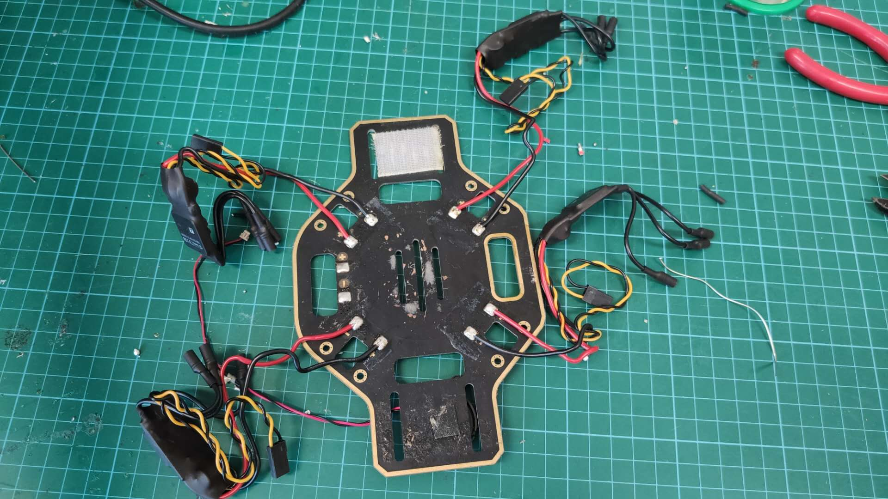
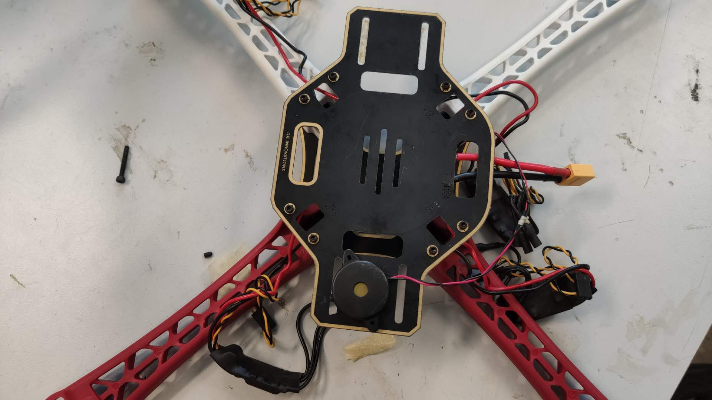
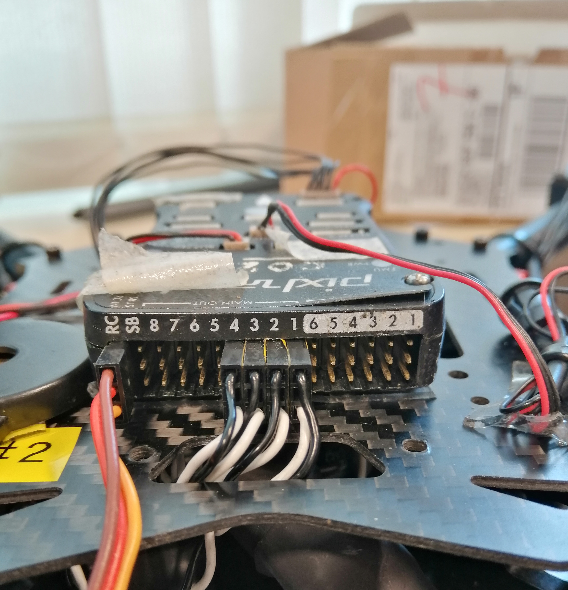

# Overview

Multirotor is a class of rotor craft that our group uses for control, perception and swarm algorithm development and testing.

# How to build a UAV platform
### 1. Solder the ESC to the PCB base plate

:::warning
Be careful with the polarity
:::

### 2. Put PCB base plate to drone frame

:::tip
Check if there is enough room for the battery.If not, expand the space 
:::

### 3. Connect ESC to flight control board and check whether it can be calibrated
### 4. Put motors on the frame
### 5. Compelete calibrations in Qgroundcontrol
### 6. Arrange wires and put propellers

---

## Platform

1. Solder ESC GND pads to AUAV Power Module 

2. Place the flight control board on the layer above with buzzer and safety switch connected

3. Connect ESC servo to flight control board 

>Connect ESC servo to **MAIN OUT** (_not AUX OUT_) according to the labelled numbers 

4. Connect receiver to RC on flight control board

:::tip
Always keep the cables neatly arranged and components fixed in place. It is recommended to use cable ties and double-sided tape to help with the practice. 
:::

:::caution
Try not to bundle the cable near the propellers for safety purposes.
:::

## Firmware 

1. Download QGroundControl on [DroneCode](https://docs.qgroundcontrol.com/master/en/getting_started/download_and_install.html) (Code is available on [GitHub](https://github.com/mavlink/qgroundcontrol))
2. Run _./QGroundControlAppImage_ on terminal
3. Connect the flight control board to computer via USB port
4. Update the firmware
5. Select correct airframe
6. Connect the vehicle to battery and calibrate ESC PWM Minimum and Maximum
7. Calibrate sensors
8. Set up and calibrate radio (controller)

>In order to connect the controller to receiver, press the LINK/MODE on receiver until the red light start blinking and then turn on the controller. When the light turns green, the connection is done.

9. Set up flight mode

:::note
More detailed information can be found on [Vehicle Setup](https://docs.qgroundcontrol.com/master/en/SetupView/SetupView.html)
:::

:::tip
Safety switch: Double blinking suggests that vehicle can be armed while single blinking suggest that vehicle is not allowed to be armed
:::

