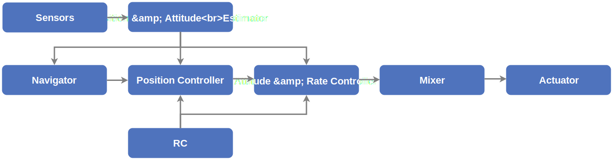

# PX4 Dynamic Control Allocation

<https://www.youtube.com/watch?v=xjLM9whwjO4>

<https://github.com/PX4/PX4-Autopilot/pull/13351>

## Introduction



Control allocation is a part of the PX4 system that computes the actuator commands from torque and thrust setpoints.

It does so by first calculating a effectiveness matrix which consists of coefficients that can be multiplied to actuator setpoints to get thrust and torque setpoints. Then, it calculates the pseudo-inverse of the effectiveness matrix to obtain the mixer matrix that can be used to calculte actuator setpoints from thrust and torque setpoints.

Currently, PX4 uses static mixing tables that are generated from airframe configurations during compilation. With the new dynamic control allocation modules, we can dynamically modify the effectiveness matrix in case of tiltrotor VTOL tilting its motors or motor failure of multirotors.

## Overall Structure

### Control Allocator


[Download the Draw.io source of the diagram above](./img/ca.drawio)

The source of the control allocation module can be found at `PX4-Autopilot/src/modules/control_allocator/`

The ControlAllocator class has two important members:

- `_control_allocation` which defines how to calculate mixer matrix from effectiveness matrix
- `_actuator_effectiveness` which provides the actuator effectiveness matrix based on airframe configurations and other settings

## Run the Default Hexrotor (Typhoon H480) Simulation

:::note
15/2/2021:

The steps below is based on [PX4 master branch commit 40a452d](https://github.com/PX4/PX4-Autopilot/tree/40a452dcd2f470541d923ff8a9556fc9a40916ca) which contains a basic version of the dynamic control allocation module. Since the module is still under development, some changes may need to be made to work with later version of the upstream repository.

Refer to [this wiki page](https://github.com/lirc573/PX4-Autopilot/wiki/Changes-Made-to-Work-With-gazebo_typhoon_h480) for the changes made to the upstream repo to work with `gazebo_typhoon_ctrlalloc`
:::

- Make sure you have installed the toolchain. If not, follow [Toolchain Installation & Setup](./px4-toolchain-installation-setup).

- Clone the repository:

```bash
git clone -b tsl-lirc572 https://github.com/lirc573/PX4-Autopilot.git --recursive
```

- Compile and run Gazebo simulation:

```bash
cd PX4-Autopilot
make px4_sitl_ctrlalloc gazebo_typhoon_ctrlalloc
# Re-run the above command if Gazebo shows a blank window
```

- To takeoff and stop one rotor, in PX4 shell:

```
commander takeoff
param set CA_ACT0_MAX 0
```

## Octo-Coaxial

Lorum ipsum
