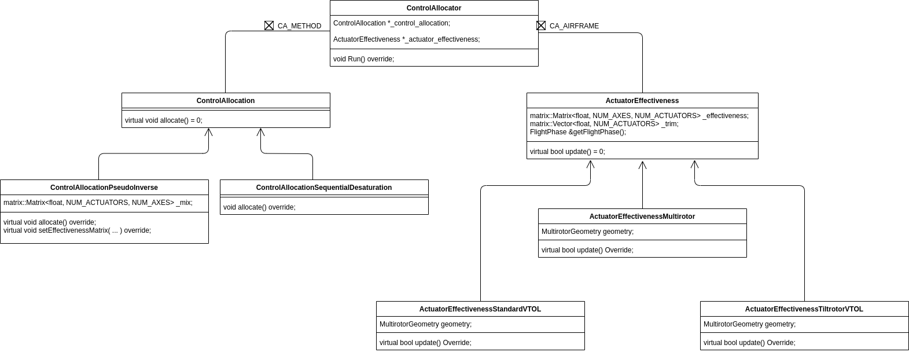

# PX4 Dynamic Control Allocation

<https://www.youtube.com/watch?v=xjLM9whwjO4>

<https://github.com/PX4/PX4-Autopilot/pull/13351>

## Introduction


Control allocation is a part of the PX4 system that computes the actuator commands from torque and thrust setpoints.

It does so by first calculating a effectiveness matrix which consists of coefficients that can be multiplied to actuator setpoints to get thrust and torque setpoints. Then, it calculates the pseudo-inverse of the effectiveness matrix to obtain the mixer matrix that can be used to calculte actuator setpoints from thrust and torque setpoints.

Currently, PX4 uses static mixing tables that are generated from airframe configurations during compilation. With the new dynamic control allocation modules, we can dynamically modify the effectiveness matrix in case of tiltrotor VTOL tilting its motors or motor failure of multirotors.

## Overall Structure

### Control Allocator



[Download the Draw.io source of the diagram above](./img/ca.drawio)

The source of the control allocation module can be found at `PX4-Autopilot/src/modules/control_allocator/`

The ControlAllocator class has two important members:

- `_control_allocation` which defines how to calculate mixer matrix from effectiveness matrix
- `_actuator_effectiveness` which provides the actuator effectiveness matrix based on airframe configurations and other settings

## Parameter Reference

| Name                | Type  | Description                                                                                                                  | Default |
| ----                | ----  | -----------                                                                                                                  | ------- |
| **CA_ACTx_MAX**     | FLOAT | Maximus value for actuator `x` (0.0-1.0)                                                                                     | 0.0     |
| **CA_ACTx_MIN**     | FLOAT | Minumum value for actuator `x` (0.0-1.0)                                                                                     | 0.0     |
| **CA_AIRFRAME**     | INT32 | Airframe ID (0: Multirotor, 1: Standard VTOL, 2: Tiltrotor VTOL)                                                             | 0       |
| **CA_AIR_SCALE_EN** | INT32 | Airspeed scaler (compensates for the variation of flap effectiveness with airspeed)                                          | 0       |
| **CA_BAT_SCALE_EN** | INT32 | Battery power level scaler (compensates for voltage drop of the battery by attempting to normalize performance across the operating range of the battery) | 0 |
| **CA_MC_Rx_AX**     | FLOAT | Axis of rotor `x` thrust vector, X body axis component                                                                       | 0.0     |
| **CA_MC_Rx_AY**     | FLOAT | Axis of rotor `x` thrust vector, Y body axis component                                                                       | 0.0     |
| **CA_MC_Rx_AZ**     | FLOAT | Axis of rotor `x` thrust vector, Z body axis component                                                                       | -1.0    |
| **CA_MC_Rx_CT**     | FLOAT | Thrust coefficient of rotor `x` (`Thrust` = `CT` * `u`^2, u: output between CA_ACTx_MIN and CA_ACTx_MAX)                     | 0.0     |
| **CA_MC_Rx_KM**     | FLOAT | Moment coefficient of rotor `x` (`Torque` = `KM` * `Thrust`, +ve for CCW rotation, -ve for CW rotation)                      | 0.05    |
| **CA_MC_Rx_PX**     | FLOAT | Position of rotor `x` along X body axis	                                                                                     | 0.0     |
| **CA_MC_Rx_PY**     | FLOAT | Position of rotor `x` along Y body axis	                                                                                     | 0.0     |
| **CA_MC_Rx_PZ**     | FLOAT | Position of rotor `x` along Z body axis	                                                                                     | 0.0     |
| **CA_METHOD**       | INT32 | Control allocation method (0: Pseudo-inverse with output clipping, 1: Pseudo-inverse with sequential desaturation technique) | 0       |

- CA_ACTx...: `x` is from 0 - 15
- CA_MC_Rx...: `x` is from 0 - 7

<https://docs.px4.io/master/en/advanced_config/parameter_reference.html#control-allocation>

## Run the Default Hexrotor x (Typhoon H480) Simulation

Airframe reference: <https://docs.px4.io/master/en/airframes/airframe_reference.html#hexarotor-x>

<details>
<summary>Deprecated</summary>

:::note
15/2/2021:

The steps below is based on [PX4 master branch commit 40a452d](https://github.com/PX4/PX4-Autopilot/tree/40a452dcd2f470541d923ff8a9556fc9a40916ca) which contains a basic version of the dynamic control allocation module. Since the module is still under development, some changes may need to be made to work with later version of the upstream repository.

Refer to [this wiki page](https://github.com/lirc573/PX4-Autopilot/wiki/Changes-Made-to-Work-With-gazebo_typhoon_h480) for the changes made to the upstream repo to work with `gazebo_typhoon_ctrlalloc`
:::

- Make sure you have installed the toolchain. If not, follow [Toolchain Installation & Setup](./px4-toolchain-installation-setup).

- Clone the repository:

```bash
git clone -b tsl-lirc572 https://github.com/lirc573/PX4-Autopilot.git --recursive
```

- Compile and run Gazebo simulation:

```bash
cd PX4-Autopilot
make px4_sitl_ctrlalloc gazebo_typhoon_ctrlalloc
# Re-run the above command if Gazebo shows a blank window
```

- To takeoff and stop one rotor, in PX4 shell:

```
commander takeoff
param set CA_ACT0_MAX 0
```

- Other [commands](https://docs.px4.io/master/en/modules/modules_controller.html#description):

```
# Control_allocator commands:
control_allocator start
control_allocator status
control_allocator start

# Use pseudo-inverse:
param set CA_METHOD 0

# Use sequential-desaturation:
param set CA_METHOD 1
```

</details>

<details open>
<summary>New</summary>

- Make sure you have installed the toolchain. If not, follow [Toolchain Installation & Setup](./px4-toolchain-installation-setup).

- Clone the repository:

```bash
git clone -b pr-control_allocation_testing https://github.com/PX4/PX4-Autopilot.git --recursive
```

- Compile and run Gazebo simulation:

```bash
cd PX4-Autopilot
make px4_sitl_ctrlalloc gazebo_typhoon_ctrlalloc
# Re-run the above command if Gazebo shows a blank window
```

- To takeoff and stop one rotor, in PX4 shell:

```
commander takeoff
param set CA_MC_R0_CT 0
```

:::note
15/2/2021:

When one of R0/R2/R5 is stopped, the multirotor can no longer turn left, when one of R1/R3/R4 is stopped, the multirotor can no longer turn right,

Flight log: <https://review.px4.io/plot_app?log=196aa41b-8af6-46dd-b3b3-645da3448a32>
:::

- Other [commands](https://docs.px4.io/master/en/modules/modules_controller.html#description):

```
# control_allocator commands:
control_allocator start
control_allocator status
control_allocator start
```

</details>

## Octo-Coaxial

Airframe reference: <https://docs.px4.io/master/en/airframes/airframe_reference.html#octorotor-coaxial>

<details open>
<summary>init script</summary>

(`ROMFS/px4fmu_common/init.d/airframes/12001_octo_cox`)

```bash
#!/bin/sh
#
# @name Octo Coaxial
#
# @type Octorotor Coaxial
# @class Copter
#
# @output MAIN1 motor 1
# @output MAIN2 motor 2
# @output MAIN3 motor 3
# @output MAIN4 motor 4
# @output MAIN5 motor 5
# @output MAIN6 motor 6
# @output MAIN7 motor 7
# @output MAIN8 motor 8
#
# @board intel_aerofc-v1 exclude
# @board bitcraze_crazyflie exclude
#

sh /etc/init.d/rc.mc_defaults
sh /etc/init.d/rc.ctrlalloc

if [ $AUTOCNF = yes ]
then
	param set MPC_XY_VEL_I_ACC 4
	param set MPC_XY_VEL_P_ACC 3

	param set RTL_DESCEND_ALT 10
	param set RTL_LAND_DELAY 0

	param set MNT_MODE_IN 0
	param set MAV_PROTO_VER 2

	param set MPC_USE_HTE 0

    # Set according to actual vehicle model
	param set VM_MASS 2.66
	param set VM_INERTIA_XX 0.06
	param set VM_INERTIA_YY 0.06
	param set VM_INERTIA_ZZ 0.10

	param set CA_AIRFRAME 0
	param set CA_METHOD 1
    
	param set CA_ACT0_MIN 0.0
	param set CA_ACT1_MIN 0.0
	param set CA_ACT2_MIN 0.0
	param set CA_ACT3_MIN 0.0
	param set CA_ACT4_MIN 0.0
	param set CA_ACT5_MIN 0.0
	param set CA_ACT6_MIN 0.0
	param set CA_ACT7_MIN 0.0
	param set CA_ACT0_MAX 1.0
	param set CA_ACT1_MAX 1.0
	param set CA_ACT2_MAX 1.0
	param set CA_ACT3_MAX 1.0
	param set CA_ACT4_MAX 1.0
	param set CA_ACT5_MAX 1.0
	param set CA_ACT6_MAX 1.0
	param set CA_ACT7_MAX 1.0

    # X: front, Y: right Z: down
    # KM: CCW: +ve, CW: -ve
    # https://docs.px4.io/master/en/airframes/airframe_reference.html#octorotor-coaxial

	param set CA_MC_R0_PX 0.7071068
	param set CA_MC_R0_PY 0.7071068
	param set CA_MC_R0_CT 9.5
	param set CA_MC_R0_KM 0.05

	param set CA_MC_R1_PX 0.7071068
	param set CA_MC_R1_PY -0.7071068
	param set CA_MC_R1_CT 9.5
	param set CA_MC_R1_KM -0.05

	param set CA_MC_R2_PX -0.7071068
	param set CA_MC_R2_PY -0.7071068
	param set CA_MC_R2_CT 9.5
	param set CA_MC_R2_KM 0.05

	param set CA_MC_R3_PX -0.7071068
	param set CA_MC_R3_PY 0.7071068
	param set CA_MC_R3_CT 9.5
	param set CA_MC_R3_KM -0.05
    
	param set CA_MC_R4_PX 0.7071068
	param set CA_MC_R4_PY -0.7071068
	param set CA_MC_R4_CT 9.5
	param set CA_MC_R4_KM 0.05

	param set CA_MC_R5_PX 0.7071068
	param set CA_MC_R5_PY 0.7071068
	param set CA_MC_R5_CT 9.5
	param set CA_MC_R5_KM -0.05

	param set CA_MC_R6_PX -0.7071068
	param set CA_MC_R6_PY 0.7071068
	param set CA_MC_R6_CT 9.5
	param set CA_MC_R6_KM 0.05

	param set CA_MC_R7_PX -0.7071068
	param set CA_MC_R7_PY -0.7071068
	param set CA_MC_R7_CT 9.5
	param set CA_MC_R7_KM -0.05
fi

set MAV_TYPE 13

# set MIXER hexa_x
set MIXER direct

```

</details>
