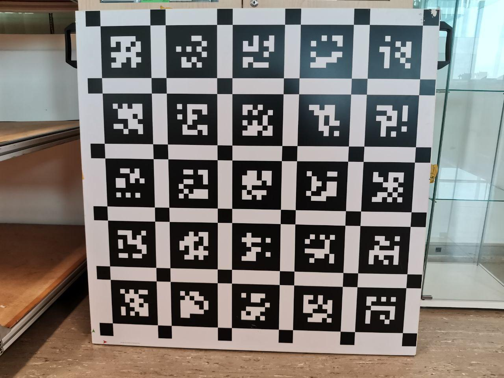

# Multi-Camera Calibration

What would be done in this tutorial:
- Prepare calibration target config file - `./april_5x5.yaml`


Optionally:
- Prepare imu config file - `./imu.yaml`

## TL; NR (Calibration Procedures)

## Calibration Target

It is strongly recommended to use Aprilgrid as the calibration target as

- partially visible calibration boards can be used
- pose of the target is fully resolved (no flips)


More details can be found on the Kalibr's [wiki page](https://github.com/ethz-asl/kalibr/wiki/calibration-targets), and a sample grid starting from detection id 0 is available [here](https://drive.google.com/file/d/0B0T1sizOvRsUdjFJem9mQXdiMTQ/edit). 

Below is the current Aprilgrid calibration board we are using and its corresponding `.yaml` file.



``` yaml title="april_5x5.yaml"
  target_type: 'aprilgrid'      #gridtype
  tagCols: 5                    #number of apriltags
  tagRows: 5                    #number of apriltags
  tagSize: 0.1500               #size of apriltag, edge to edge [m]
  tagSpacing: 0.30001           #ratio of space between tags to tagSize, for our apriltag spacing = 0.029
  low_id: 25                    #the lowest detection id within the grid, normally on the bottom-left
```

### About `low_id`

Observe that the first grid (closest to the coordinate marker) in the board above has the same encoding as the 26-th grid in a typical [board](https://drive.google.com/file/d/0B0T1sizOvRsUdjFJem9mQXdiMTQ/edit). This is because the board we are using is purpose-made to start from a different id other than the default zero. Therefore, the `low_id` field is to be added in the yaml file to tell the calibration algorithm about this fact.

The stock Kalibr pacakges does not support defining the lowest id natively (it always assumes the id starts from 0), hence we have added the `low_id` feature, refering to the [commit](https://github.com/chengguizi/kalibr/commit/8d1a7846ab3ad9d5475fa3b816c92b90da8f6eb8).

## Installation

Kalibr is a ROS package, so it is to be cloned into the `src/` directory of the caktin workspace.

This version builds on top of the official repository, which:
- works with a calibration board with non-zero `low_id` 
- works correctly with Double Sphere Camera Model

``` bash
# cd into the src folder of the catkin workspace
git clone https://github.com/chengguizi/kalibr
catkin build kalibr
# it takes quite a while to compile...
```


More on catkin build, refer [here](../../linux/ros/using-catkin-build.md). To verify the installation, command `kalibr_calibrate_cameras` should exist.

---

## Optionally to Calibrate IMU-Camera

This step is usually not needed, as the calibration result is generally not accurate, especially in the relative position between the IMU and the cameras.

It might only be useful to serve as a way to determine the mounting position and coordinate systems used in both IMU and the cameras.


### The IMU Config File


``` yaml title="imu.yaml"
#Accelerometers
accelerometer_noise_density: 1.86e-03   #Noise density (continuous-time)
accelerometer_random_walk:   4.33e-04   #Bias random walk

#Gyroscopes
gyroscope_noise_density:     1.87e-04   #Noise density (continuous-time)
gyroscope_random_walk:       2.66e-05   #Bias random walk

rostopic:                    /mavros/imu/data     #the IMU ROS topic
update_rate:                 360.0      #Hz (for discretization of the values above)
```